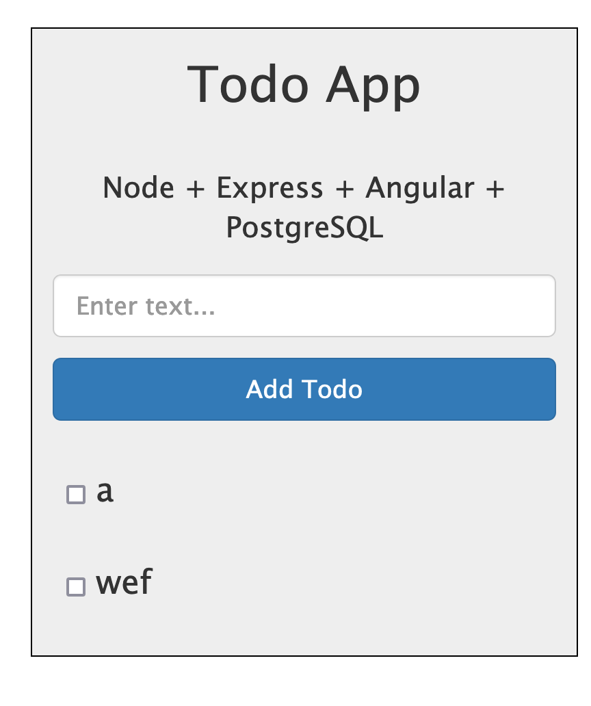

# Overview

This is a simple webapp for managing TODO list, with data persisted in postgres.

I got webapp source code from here: https://github.com/mjhea0/node-postgres-todo
then I added dockerfile + write docker-compose for it myself.

I have put some effort to upgrade the pg library, and updated code to use pg.Pool + async/await instead.

# How-to

For detail, see comments in docker-compose.yml
To run:

```bash
docker-compose up --build web
```

Open browser, access `localhost:3000`. you should see something like: 

# Known issue

- No data validation done -> submit an empty todo list will cause the app to crash.

