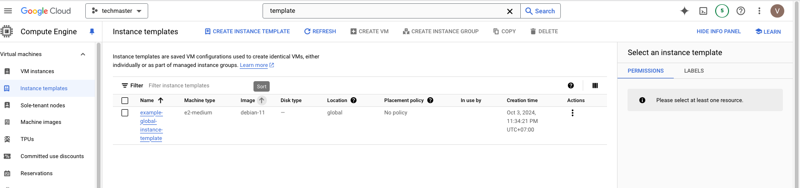
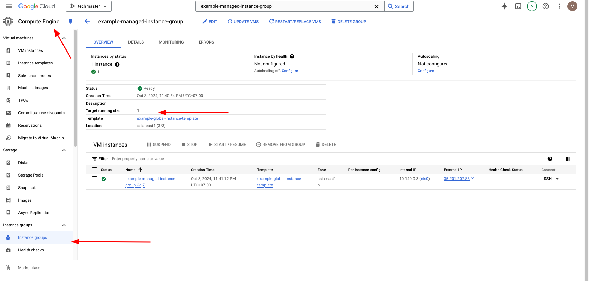
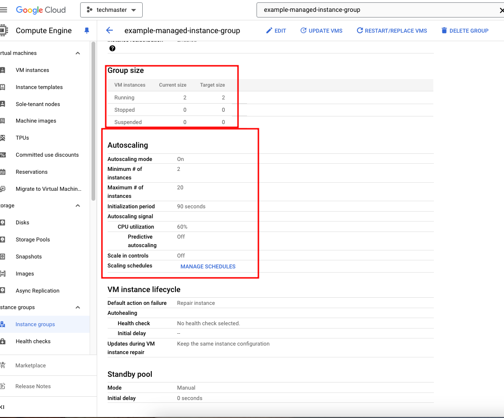

# Before continue
- Download and install gcloud + authenticate (see [lab07](../lab07/README.md)).

# Setup
## Create a template for scaling
```bash
gcloud compute instance-templates create example-global-instance-template \
    --machine-type=e2-medium \
    --image-family=debian-11 \
    --image-project=debian-cloud \
    --network=default \
    --tags=http-server,https-server
```

This will create a template (specification) for your GCE instance, which will be added/removed from your autoscaling group when conditions are met.

Example output:
```txt
Created [https://www.googleapis.com/compute/v1/projects/XXXX/global/instanceTemplates/example-global-instance-template].
NAME                              MACHINE_TYPE  PREEMPTIBLE  CREATION_TIMESTAMP
example-global-instance-template  e2-medium                  2024-10-03T09:34:21.401-07:00

```

Check in GCP Console, you should see something like: 

## Create autoscaling groups

```bash
# set --template to name of template created in previous step
gcloud compute instance-groups managed create example-managed-instance-group \
      --region asia-east1 \
      --template example-global-instance-template \
      --size 1

```

This will create an autoscaling group with 1 VM (`--size 1`) initially.

Output:
```txt
Created [https://www.googleapis.com/compute/v1/projects/XXX/regions/asia-east1/instanceGroupManagers/example-managed-instance-group].
NAME                            LOCATION    SCOPE   BASE_INSTANCE_NAME              SIZE  TARGET_SIZE  INSTANCE_TEMPLATE                 AUTOSCALED
example-managed-instance-group  asia-east1  region  example-managed-instance-group  0     1            example-global-instance-template  no
```

In console, you should see something like 


## Configure autoscaling:

```bash
gcloud compute instance-groups managed set-autoscaling example-managed-instance-group \
    --region asia-east1 \
    --min-num-replicas 2 \
    --max-num-replicas 20 \
    --target-cpu-utilization 0.60 \
    --cool-down-period 90
```

- This will create an autoscaling instance group name `example-managed-instance-group`
- Which number of instance will be between 2 -> 20 instances
- Scaling group will add more instance (scale out) when:
  - Average CPU utilization > 60%, with a cooldown of 90 seconds after adding instances (not taking action within 90 sec)
- Scaling group will remove instance (scale in) when:
  - Average CPU utilization < 60%, with a cooldown of __10 minute__ after adding instances (not taking action within 10 mins)

> Why scale-in cool down is 10 mins, instead of 90 secs?
according to [GCP Documentation](https://cloud.google.com/compute/docs/autoscaler#autoscaling_policy): The stabilization period is equal to 10 minutes or to the initialization period that you set, whichever is longer. The stabilization period is used only for scale-in decisions when the autoscaler has to delete VMs.

Output:

```txt
Created [https://www.googleapis.com/compute/v1/projects/XXXX/regions/asia-east1/autoscalers/example-managed-instance-group-qy4t].
---
autoscalingPolicy:
  coolDownPeriodSec: 90
  cpuUtilization:
    utilizationTarget: 0.6
  maxNumReplicas: 20
  minNumReplicas: 2
  mode: ON
creationTimestamp: '2024-10-03T09:48:09.545-07:00'
id: '5515719093356033062'
kind: compute#autoscaler
name: example-managed-instance-group-qy4t
region: https://www.googleapis.com/compute/v1/projects/XXXX/regions/asia-east1
selfLink: https://www.googleapis.com/compute/v1/projects/XXXX/regions/asia-east1/autoscalers/example-managed-instance-group-qy4t
status: ACTIVE
target: https://www.googleapis.com/compute/v1/projects/XXXX/regions/asia-east1/instanceGroupManagers/example-managed-instance-group

```

Check in console, you can see autoscaling policy is now configured, and its size now is 2 instances (`min replica`, compared to 1 as before).


