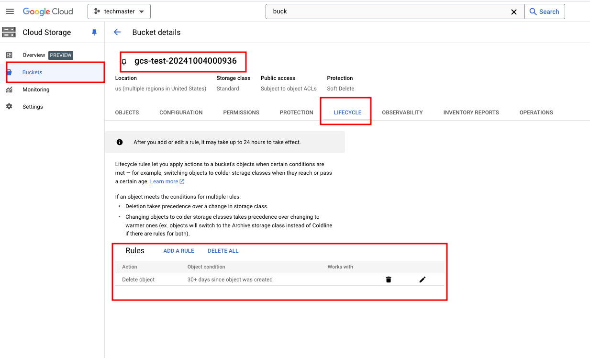

# Before start
- Download / install / login Gcloud SDK (see [lab07](../lab07/README.md))
- Check if `gsutil` command available

# Usage
```bash
$ bash create_gcs_bucket.bash
Creating GCS bucket: gs://gcs-test-20241004000936/
Creating gs://gcs-test-20241004000936/...
Setting lifecycle policy for bucket: gs://gcs-test-20241004000936/
Setting lifecycle configuration on gs://gcs-test-20241004000936/...
Bucket created and lifecycle policy set successfully.

```

Set env `BUCKET_NAME` to override bucket name (default `gcs-test-yyyymmddhhmmss`)

`lifecycle_policy.json` ensure that objects in created GCS bucket with `age > 30 days` will be deteted.
The bash script creates a bucket and attach policy to it.


Go to console's GCS UI, then in `Policy` tab of the bucket, you should see the deletion policy.

