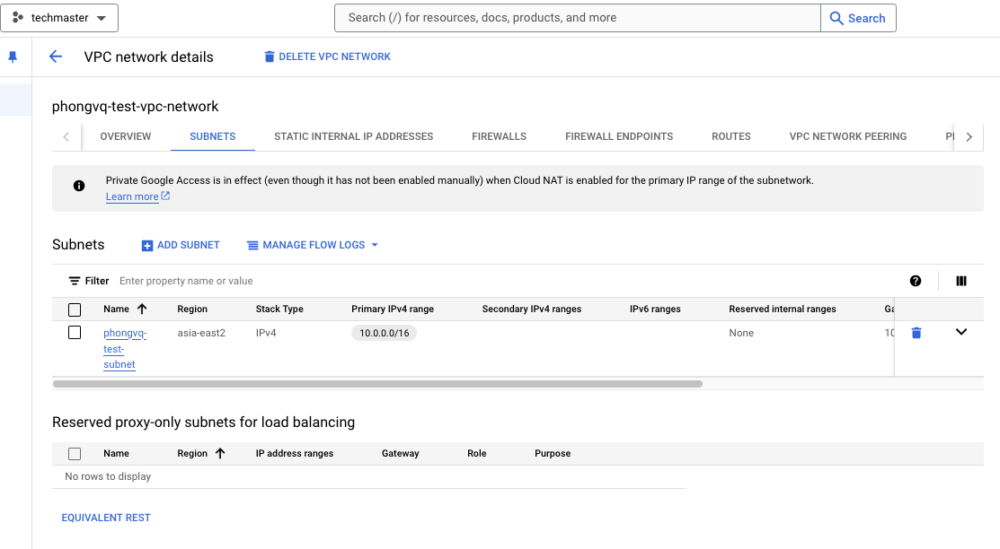
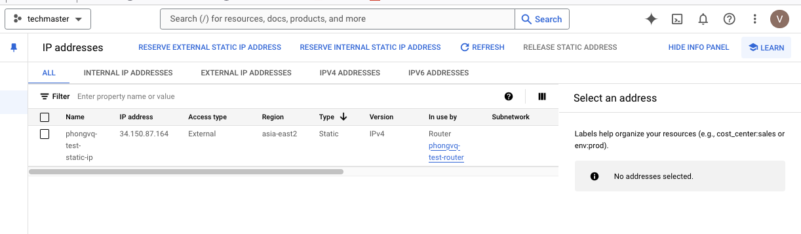
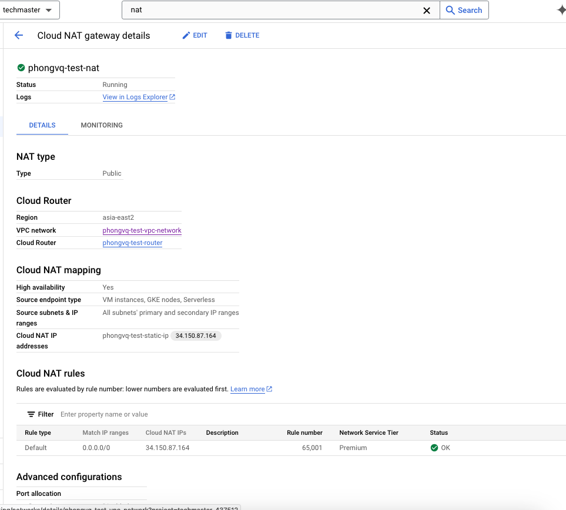

# Overview

This is a terraform module to provision:
- A VPC with one subnet inside
- A static public IP, attach it to a NAT Router.
This allow application/service in the subnet (in GCE, GKE, etc. for example)

# Preparation
- Install terraform. See [this guide](https://developer.hashicorp.com/terraform/tutorials/aws-get-started/install-cli)
- Download, install Google Cloud SDK to use `gcloud` (see [lab07](../lab07/README.md))
- To make terraform work without specifying credentials, authenticate using User Application Default Credentials ("ADCs") as a primary authentication method, see more at [this link](https://registry.terraform.io/providers/hashicorp/google/latest/docs/guides/provider_reference.html#running-terraform-on-your-workstation)
```bash
gcloud auth application-default login
```

# Provision infrastructure
- Run `terraform init` to install terraform module dependencies.
- Run `terraform plan` to see what will be provisioned. It should show output similar to below. `+` indicates that the resources/attributes has not been existed, and will by added/created when applying.

```txt
google_compute_network.vpc_network: Refreshing state... [id=projects/XXXX/global/networks/phongvq-test-vpc-network]
google_compute_address.static_ip: Refreshing state... [id=projects/XXXX/regions/asia-east2/addresses/phongvq-test-static-ip]

Terraform used the selected providers to generate the following execution plan. Resource actions are indicated with the following symbols:
  + create

Terraform will perform the following actions:

  # google_compute_router.router will be created
  + resource "google_compute_router" "router" {
      + creation_timestamp = (known after apply)
      + id                 = (known after apply)
  ...
          + identifier_range   = (known after apply)
          + keepalive_interval = 20
  ...
        }
    }

  # google_compute_router_nat.nat will be created
  + resource "google_compute_router_nat" "nat" {
      + auto_network_tier                   = (known after apply)
      ...
      + udp_idle_timeout_sec                = 30
    }

  # google_compute_subnetwork.subnet will be created
  + resource "google_compute_subnetwork" "subnet" {
      + creation_timestamp         = (known after apply)
      ...
      + stack_type                 = (known after apply)
    }

Plan: 3 to add, 0 to change, 0 to destroy.

────────────────────────────────────────────────────────────────────────────────────────────────────────────────────────────────────────────────────────────────

Note: You didn't use the -out option to save this plan, so Terraform can't guarantee to take exactly these actions if you run "terraform apply" now.

```

- Run `terraform apply`, wait for plan to show again, type `yes` to provision resource. If you want terraform to provision without confirmation, run `terraform apply -auto-approve`. Output should be similar to below:

```txt
<plan showed>
...
Plan: 5 to add, 0 to change, 0 to destroy.
google_compute_network.vpc_network: Creating...
google_compute_address.static_ip: Creating...
google_compute_address.static_ip: Creation complete after 3s [id=projects/XXXXX/regions/asia-east2/addresses/phongvq-test-static-ip]
google_compute_network.vpc_network: Still creating... [10s elapsed]
...

google_compute_router.router: Creation complete after 22s [id=projects/XXXXX/regions/asia-east2/routers/phongvq-test-router]
google_compute_router_nat.nat: Creating...
google_compute_subnetwork.subnet: Creation complete after 23s [id=projects/XXXXX/regions/asia-east2/subnetworks/phongvq-test-subnet]
google_compute_router_nat.nat: Still creating... [10s elapsed]
google_compute_router_nat.nat: Creation complete after 12s [id=XXXXX/asia-east2/phongvq-test-router/phongvq-test-nat]

Apply complete! Resources: 5 added, 0 changed, 0 destroyed.

```

- Go to GCP console to double check.

VPC + Subnet:


Static IP (use for outbound traffic, which goes through NAT router):


Cloud NAT:


__IMPORTANT__: be cautious when run this command below in real system.

- To clean resource, run `terraform destroy`, type `yes` to confirm. `-` in the output indicates that attributes/resources will be destroyed.

```txt
...
      - stack_type                 = "IPV4_ONLY" -> null
    }

Plan: 0 to add, 0 to change, 5 to destroy.
google_compute_subnetwork.subnet: Destroying... [id=projects/XXXXX/regions/asia-east2/subnetworks/phongvq-test-subnet]
google_compute_router_nat.nat: Destroying... [id=XXXXX/asia-east2/phongvq-test-router/phongvq-test-nat]
google_compute_subnetwork.subnet: Still destroying... [id=projects/XXXXX/regions/asia-east2/subnetworks/phongvq-test-subnet, 10s elapsed]
google_compute_router_nat.nat: Still destroying... [id=XXXXX/asia-east2/phongvq-test-router/phongvq-test-nat, 10s elapsed]

```
