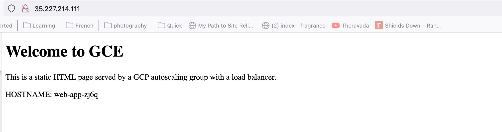
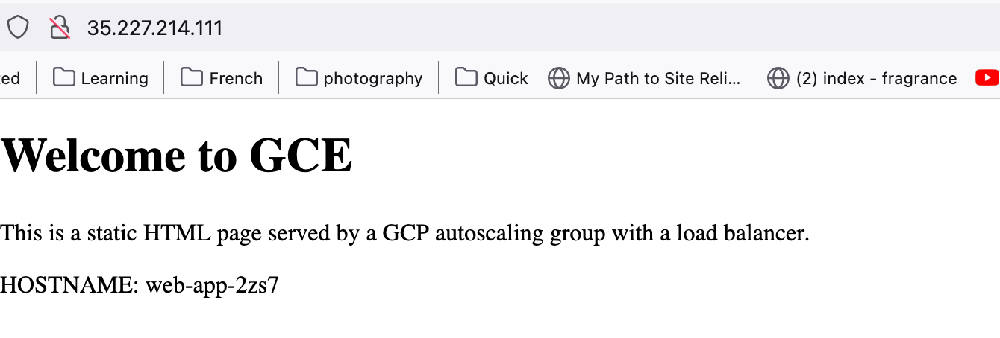
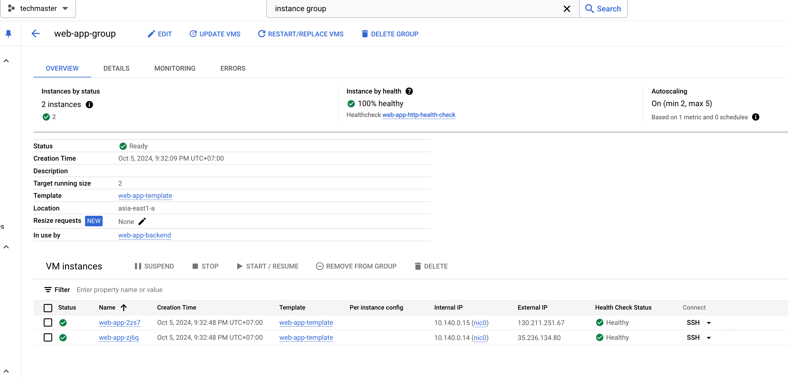
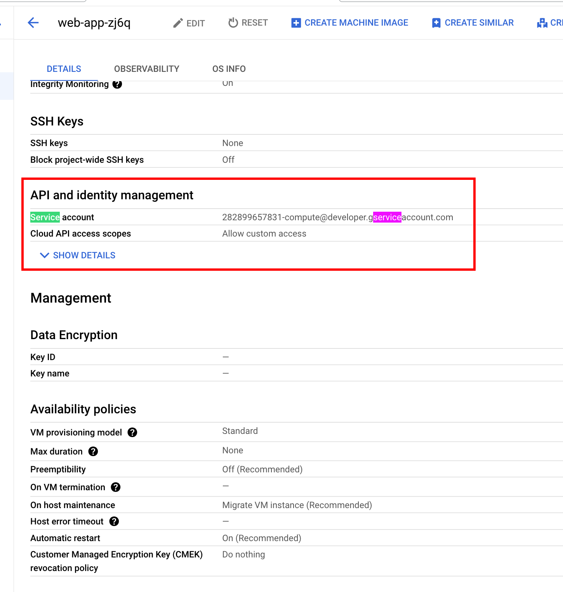
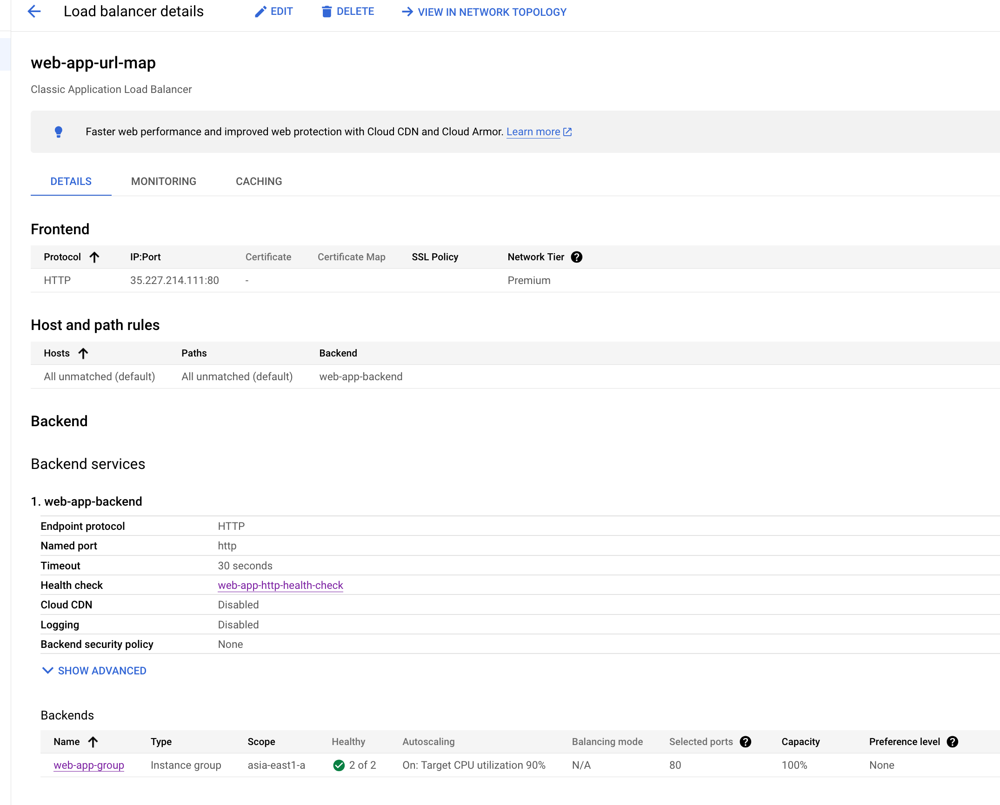
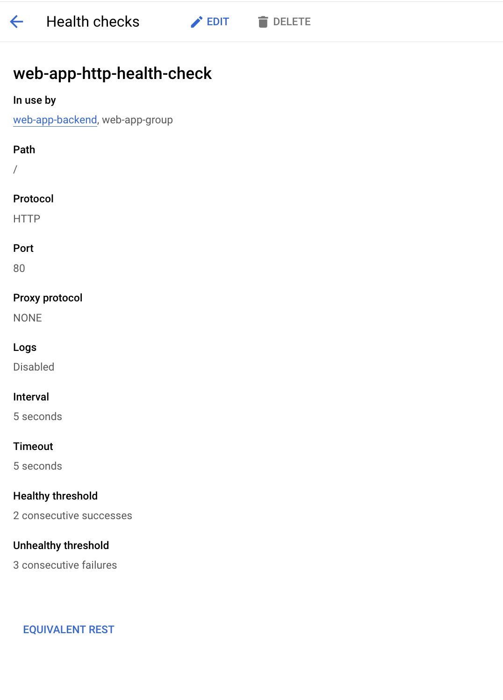
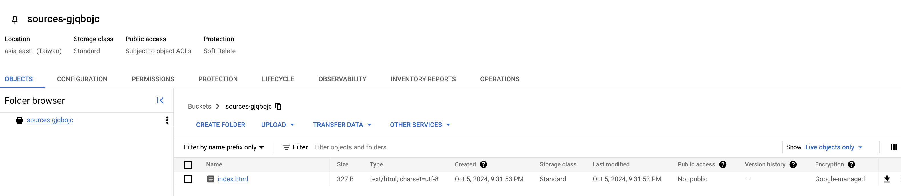

# Overview

This terraform will provision a webapp instance group, which stands behind a Load Balancer, and be able to scale automatically when CPU go beyound specific threshold.

From a high level view, this module will:
- Provision a set of VM within instance group.
- These VMs auto scale out when CPU greater than a specific threshold.
- Create a GCS bucket, upload script into it.
- Configure VM so that source code will be pulled from GCS, to VMs when they are created.
  - IAM Role is attached to VMs, so that they can pull the code from GCS without storing any key, password.
- Provision a load balancer that will route HTTP traffic (port 80) to those VMs.

__Note__: To read more about auto-scaling policy, refer to [lab08](../lab08/).

# Preparation
- Install terraform. See [this guide](https://developer.hashicorp.com/terraform/tutorials/aws-get-started/install-cli)
- Download, install Google Cloud SDK to use `gcloud` (see [lab07](../lab07/README.md))
- To make terraform work without specifying credentials, authenticate using User Application Default Credentials ("ADCs") as a primary authentication method, see more at [this link](https://registry.terraform.io/providers/hashicorp/google/latest/docs/guides/provider_reference.html#running-terraform-on-your-workstation)
```bash
gcloud auth application-default login
```

# Provision infrastructure
- Run `terraform init` to install terraform module dependencies.
- Run `terraform plan` to see what will be provisioned. It should show output similar to below. `+` indicates that the resources/attributes has not been existed, and will by added/created when applying.


```
google_compute_instance_template.web_app_template: Creating...
google_compute_instance_template.web_app_template: Creation complete after 4s [id=projects/XXXXX/global/instanceTemplates/web-app-template]
google_compute_region_instance_group_manager.web_app_group: Creating...
google_compute_region_instance_group_manager.web_app_group: Still creating... [10s elapsed]
google_compute_region_instance_group_manager.web_app_group: Still creating... [20s elapsed]
google_compute_region_instance_group_manager.web_app_group: Still creating... [30s elapsed]
...
Plan: 11 to add, 0 to change, 0 to destroy.
```

- Run `terraform apply`, wait for plan to show again, type `yes` to provision resource. If you want terraform to provision without confirmation, run `terraform apply -auto-approve`. Output should be similar to below:

```txt
<plan showed>

random_string.gcs_name_suffix: Creating...
random_string.gcs_name_suffix: Creation complete after 0s [id=gjqbojc]
google_compute_firewall.allow_http: Creating...
google_project_iam_member.gce_default_storage_access: Creating...
google_compute_health_check.http: Creating...
google_storage_bucket.static_site_bucket: Creating...
google_storage_bucket.static_site_bucket: Creation complete after 3s [id=sources-gjqbojc]
google_storage_bucket_object.static_html_files["index.html"]: Creating...
google_compute_instance_template.web_app_template: Creating...
...
google_compute_instance_group_manager.web_app_group: Still creating... [30s elapsed]
google_compute_instance_group_manager.web_app_group: Still creating... [40s elapsed]
google_compute_instance_group_manager.web_app_group: Creation complete after 44s [id=projects/XXXXX/zones/asia-east1-a/instanceGroupManagers/web-app-group]
google_compute_autoscaler.web_app_autoscaler: Creating...
...
google_compute_global_forwarding_rule.web_app_forwarding_rule: Still creating... [10s elapsed]
google_compute_global_forwarding_rule.web_app_forwarding_rule: Still creating... [20s elapsed]
google_compute_global_forwarding_rule.web_app_forwarding_rule: Creation complete after 23s [id=projects/XXXXX/global/forwardingRules/web-app-forwarding-rule]

Apply complete! Resources: 13 added, 0 changed, 0 destroyed.

Outputs:

load_balancer_ip = "35.227.214.111"                <-- you should see your own Load Balancer's public IP here.
```

- Access webapp via public IP from Terraform's output - in this case, 35.227.214.111.
- Try to refresh several time, you will see HTTP traffic will be splited into 2 VMs (in this example, I provisioned 2 VMs).




As you can see, the host name at the bottom changed!

__OPTIONAL__: exploring GCP console to see what have been provisioned.






