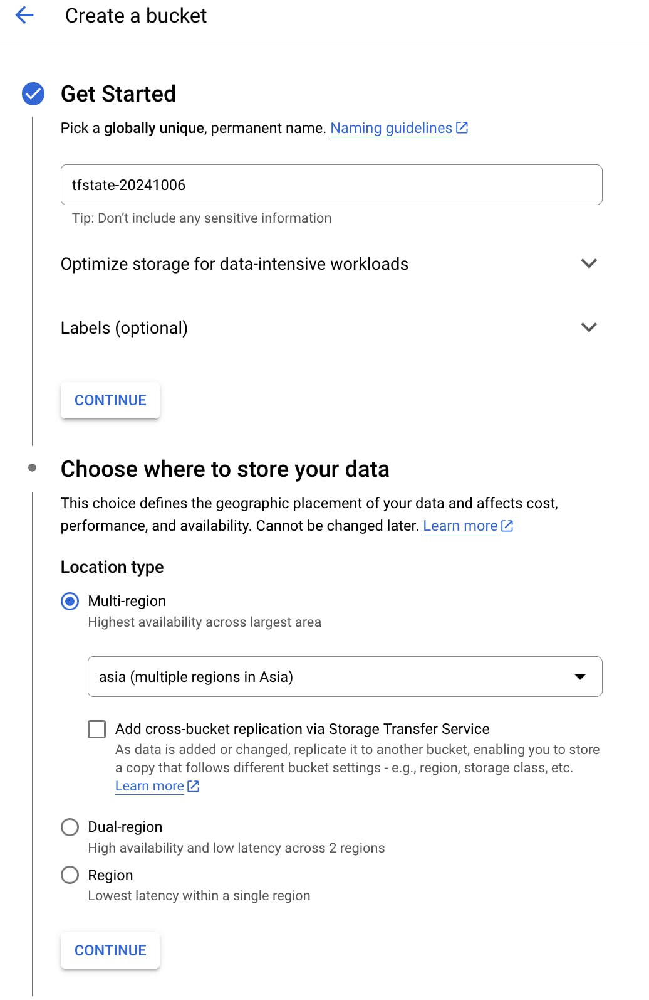
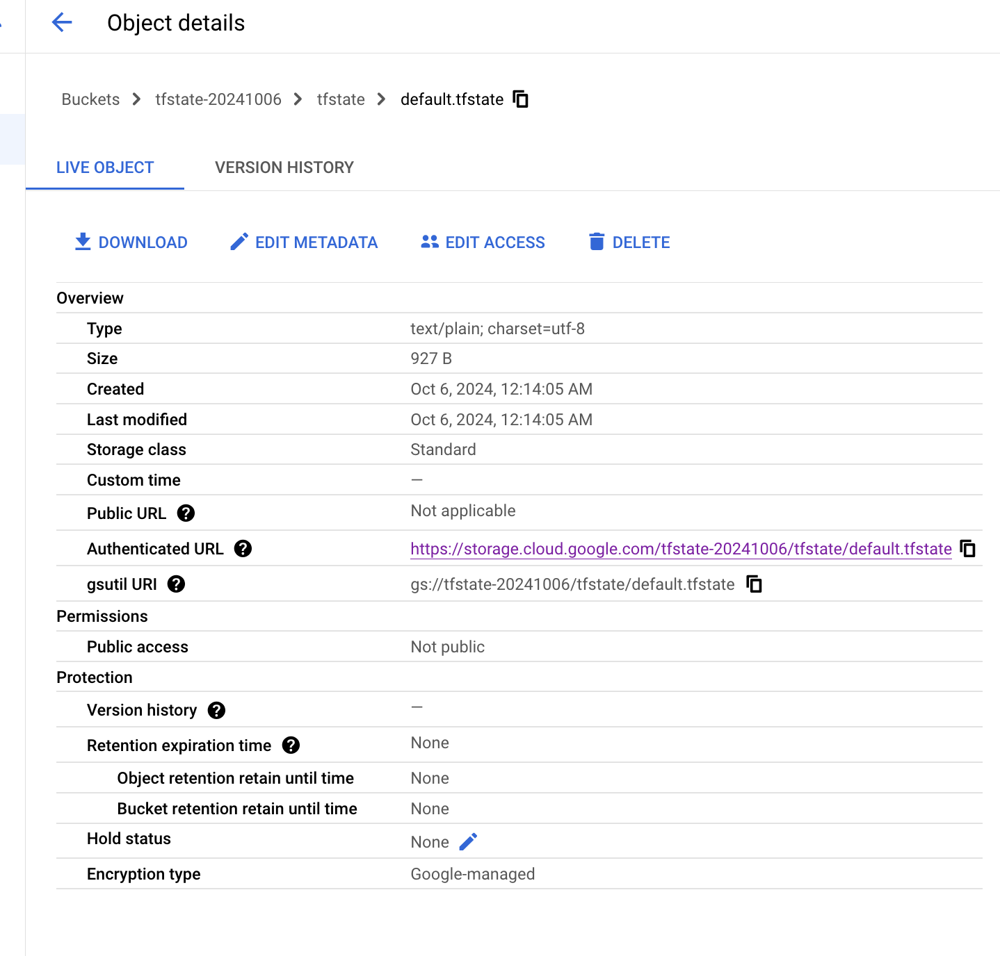

# Overview

This is a base terraform for store tfstate in remote GCS bucket.

# Preparation
- Install terraform. See [this guide](https://developer.hashicorp.com/terraform/tutorials/aws-get-started/install-cli)
- Download, install Google Cloud SDK to use `gcloud` (see [lab07](../lab07/README.md))
- To make terraform work without specifying credentials, authenticate using User Application Default Credentials ("ADCs") as a primary authentication method, see more at [this link](https://registry.terraform.io/providers/hashicorp/google/latest/docs/guides/provider_reference.html#running-terraform-on-your-workstation)
```bash
gcloud auth application-default login
```

# Setup

- Go to GCP Console (or use gsutil command, whatever you are familiar with), to create a GCS bucket for tfstate storage. In this example, bucket name: `tfstate-20241006`



- Run `terraform init`, `terraform plan`, and then `terraform apply`.

- `terraform plan` should show one random resource (use for testing), which will be created


```txt
> terraform plan

Terraform used the selected providers to generate the following execution plan. Resource actions are indicated with the following symbols:
  + create

Terraform will perform the following actions:

  # random_string.gcs_name_suffix will be created
  + resource "random_string" "gcs_name_suffix" {
      + id          = (known after apply)
      + length      = 7
      + lower       = true
      + min_lower   = 0
      + min_numeric = 0
      + min_special = 0
      + min_upper   = 0
      + number      = false
      + numeric     = false
      + result      = (known after apply)
      + special     = false
      + upper       = false
    }

Plan: 1 to add, 0 to change, 0 to destroy.

```

- `terraform apply -auto-approve` output:
```txt
> terraform apply -auto-approve

Terraform used the selected providers to generate the following execution plan. Resource actions are indicated with the following symbols:
  + create

Terraform will perform the following actions:
...
Plan: 1 to add, 0 to change, 0 to destroy.
random_string.gcs_name_suffix: Creating...
random_string.gcs_name_suffix: Creation complete after 0s [id=nvhgsfq]

Apply complete! Resources: 1 added, 0 changed, 0 destroyed.


```

- Let's go to the created GCS bucket to check, you should see this tfstate object: `tfstate-20241006/tfstate/default.tfstate`



- Download this file, and open it to check, it should have content similar to below:

```json
{
  "version": 4,
  "terraform_version": "1.5.7",
  "serial": 2,
  "lineage": "e0edb393-c268-875d-3ae5-62b181ce67c2",
  "outputs": {},
  "resources": [
    {
      "mode": "managed",
      "type": "random_string",
      "name": "gcs_name_suffix",
      "provider": "provider[\"registry.terraform.io/hashicorp/random\"]",
      "instances": [
        {
          "schema_version": 2,
          "attributes": {
            "id": "nvhgsfq",
            "keepers": null,
            "length": 7,
            "lower": true,
            "min_lower": 0,
            "min_numeric": 0,
            "min_special": 0,
            "min_upper": 0,
            "number": false,
            "numeric": false,
            "override_special": null,
            "result": "nvhgsfq",
            "special": false,
            "upper": false
          },
          "sensitive_attributes": []
        }
      ]
    }
  ],
  "check_results": null
}
```
